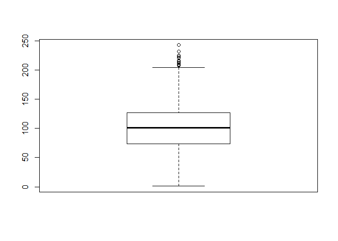
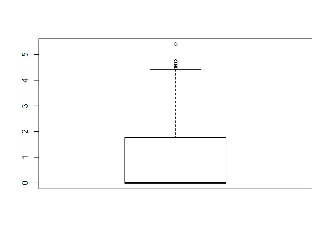

Churn Prediction
================
Sheetanshu
7/31/2020

``` r
getwd()
```

    ## [1] "C:/Users/Admin/Desktop/ML Lab Session/jfjtfjtyfyjtfytf"

``` r
Cellphn.d = read.csv("Cellphonedata.csv")
View(Cellphn.d)
summary(Cellphn.d)
```

    ##      Churn         AccountWeeks   ContractRenewal     DataPlan     
    ##  Min.   :0.0000   Min.   :  1.0   Min.   :0.0000   Min.   :0.0000  
    ##  1st Qu.:0.0000   1st Qu.: 74.0   1st Qu.:1.0000   1st Qu.:0.0000  
    ##  Median :0.0000   Median :101.0   Median :1.0000   Median :0.0000  
    ##  Mean   :0.1449   Mean   :101.1   Mean   :0.9031   Mean   :0.2766  
    ##  3rd Qu.:0.0000   3rd Qu.:127.0   3rd Qu.:1.0000   3rd Qu.:1.0000  
    ##  Max.   :1.0000   Max.   :243.0   Max.   :1.0000   Max.   :1.0000  
    ##    DataUsage      CustServCalls      DayMins         DayCalls    
    ##  Min.   :0.0000   Min.   :0.000   Min.   :  0.0   Min.   :  0.0  
    ##  1st Qu.:0.0000   1st Qu.:1.000   1st Qu.:143.7   1st Qu.: 87.0  
    ##  Median :0.0000   Median :1.000   Median :179.4   Median :101.0  
    ##  Mean   :0.8165   Mean   :1.563   Mean   :179.8   Mean   :100.4  
    ##  3rd Qu.:1.7800   3rd Qu.:2.000   3rd Qu.:216.4   3rd Qu.:114.0  
    ##  Max.   :5.4000   Max.   :9.000   Max.   :350.8   Max.   :165.0  
    ##  MonthlyCharge      OverageFee       RoamMins    
    ##  Min.   : 14.00   Min.   : 0.00   Min.   : 0.00  
    ##  1st Qu.: 45.00   1st Qu.: 8.33   1st Qu.: 8.50  
    ##  Median : 53.50   Median :10.07   Median :10.30  
    ##  Mean   : 56.31   Mean   :10.05   Mean   :10.24  
    ##  3rd Qu.: 66.20   3rd Qu.:11.77   3rd Qu.:12.10  
    ##  Max.   :111.30   Max.   :18.19   Max.   :20.00

``` r
boxplot(Cellphn.d$AccountWeeks)
```

<!-- -->

``` r
boxplot(Cellphn.d$DataUsage)
```

<!-- -->
